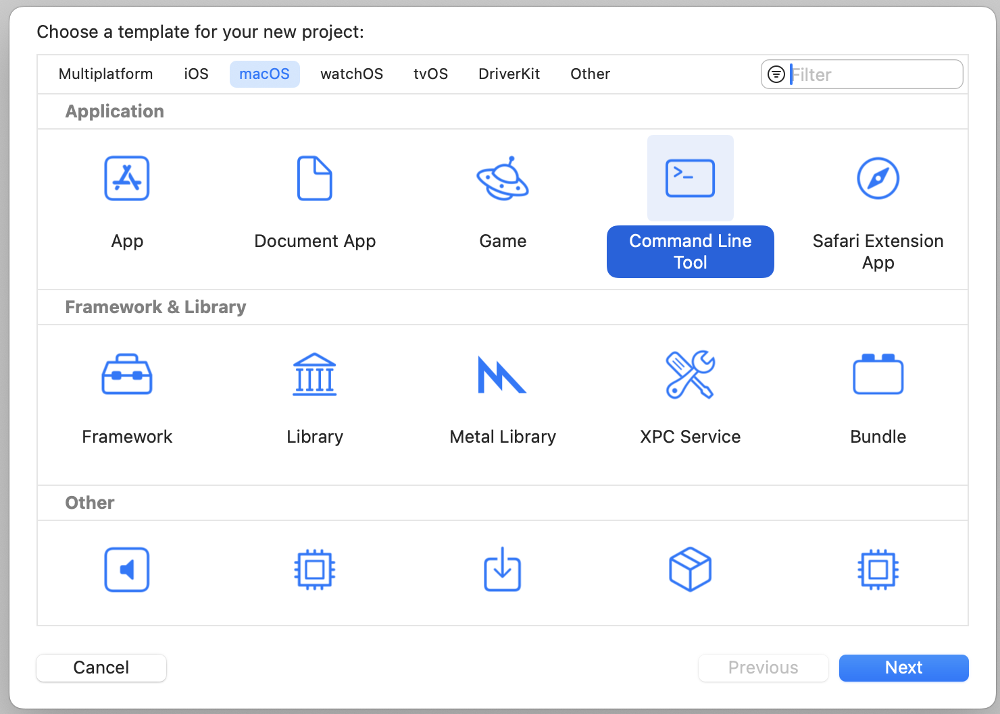
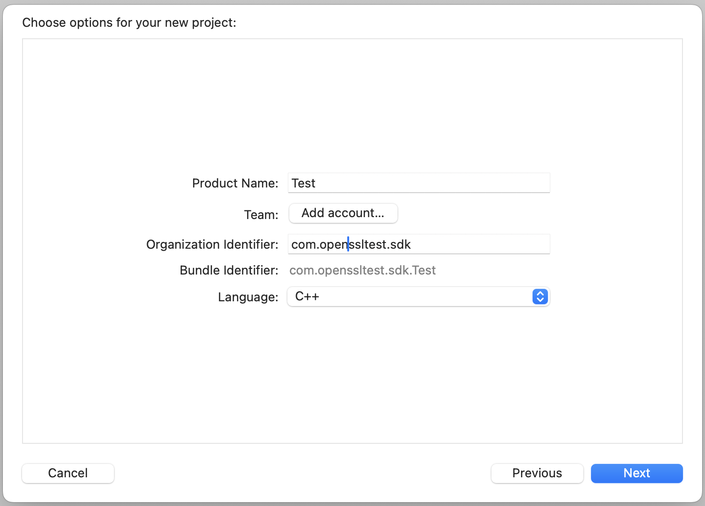
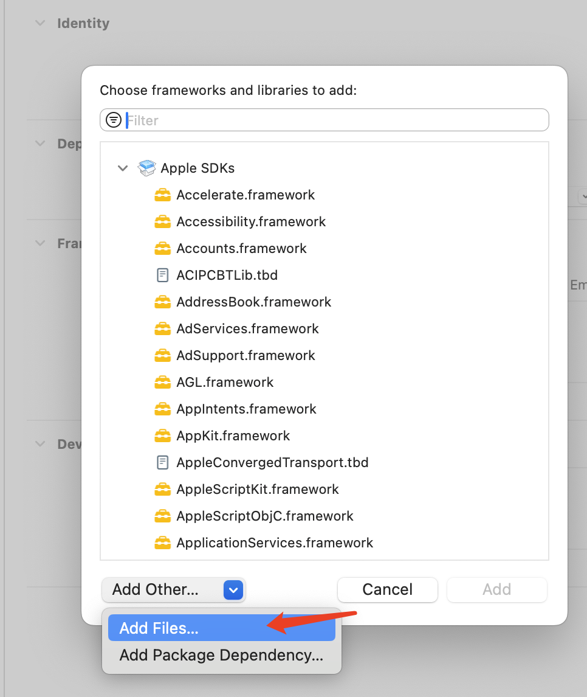
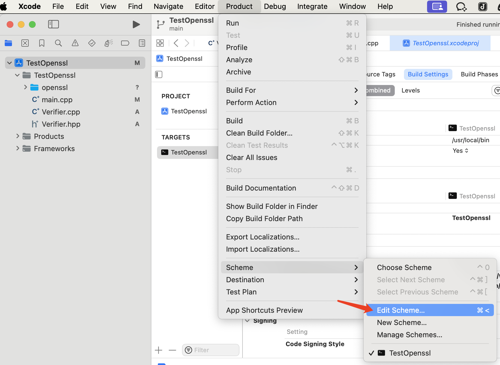

# 

### [中文](./README_zh-CN.md)

# iOS/MacOS

The following works completed in a Macbook Pro (M1 CPU, MacOS Sonoma 14.0)

## Compile OpenSSL

First we need to check our local environment, execute `xcode-select -print-path`  to see if the path is correct. For me, I ran `sudo xcode-select -switch /Applications/Xcode.app/Contents/Developer` to set correct development environment.

Here we only compile for iOS, iOS simulator and MacOS. You can do similar work for other Apple hardwares.

If you met odd problem like `.../clang/15.0.0/include/inttypes.h:21:15: fatal error: 'inttypes.h' file not found` , don't panic at this time, **restart** the system may solve it...

### iOS

OpenSSL compile manual for iOS: https://wiki.openssl.org/index.php/Compilation_and_Installation#iOS

```bash
cd ~/workspace/openssl-3.0.12

export CC=clang
export CROSS_TOP=/Applications/Xcode.app/Contents/Developer/Platforms/iPhoneOS.platform/Developer
export CROSS_SDK=iPhoneOS.sdk
export PATH=/Applications/Xcode.app/Contents/Developer/Toolchains/XcodeDefault.xctoolchain/usr/bin:$PATH

./Configure ios64-cross no-shared no-dso no-hw no-engine --prefix="/Users/tattoo/workspace/openssl-3.0.12/openssl-ios64"

make
make install
make clean
```

To get value of `CROSS_SDK`, you may `ls /Applications/Xcode.app/Contents/Developer/Platforms/iPhoneOS.platform/Developer/SDKs`.

And architecture option can be found in `Configurations/15-ios.conf` (here we use `ios64-cross`).

In order to distinguish them from the later MacOS libraries, the compiled static library files are renamed here with `-iOS` suffix:

- `libssl-iOS.a`
- `libcrypto-iOS.a`

### iOS Simulator

We need to compile simulator's library separately.

```bash
cd ~/workspace/openssl-3.0.12

export CC=clang
export CROSS_TOP=/Applications/Xcode.app/Contents/Developer/Platforms/iPhoneSimulator.platform/Developer
export CROSS_SDK=iPhoneSimulator.sdk
export PATH=/Applications/Xcode.app/Contents/Developer/Toolchains/XcodeDefault.xctoolchain/usr/bin:$PATH

./Configure iossimulator-xcrun no-shared no-dso no-hw no-engine --prefix="/Users/tattoo/workspace/openssl-3.0.12/openssl-iossimulator"

make
make install
make clean
```

In order to distinguish them from the later MacOS libraries, the compiled static library files are renamed here with `-iossimulator` suffix:

- `libssl-iossimulator.a`
- `libcrypto-iossimulator.a`

### MacOS

OpenSSL compile manual for MacOS: https://wiki.openssl.org/index.php/Compilation_and_Installation#OS_X

```bash
cd ~/workspace/openssl-3.0.12

# x86_64
./Configure darwin64-x86_64-cc --prefix="/Users/tattoo/workspace/openssl-3.0.12/openssl-darwin-x86_64" no-asm

make
make install
make clean

# arm64
./Configure darwin64-arm64-cc --prefix="/Users/tattoo/workspace/openssl-3.0.12/openssl-darwin-arm64" no-asm

make
make install
make clean

# merge
mkdir -p /Users/tattoo/workspace/openssl-3.0.12/openssl-darwin/

lipo -create /Users/tattoo/workspace/openssl-3.0.12/openssl-darwin-x86_64/lib/libssl.a /Users/tattoo/workspace/openssl-3.0.12/openssl-darwin-arm64/lib/libssl.a -output /Users/tattoo/workspace/openssl-3.0.12/openssl-darwin/libssl.a

lipo -create /Users/tattoo/workspace/openssl-3.0.12/openssl-darwin-x86_64/lib/libcrypto.a /Users/tattoo/workspace/openssl-3.0.12/openssl-darwin-arm64/lib/libcrypto.a -output /Users/tattoo/workspace/openssl-3.0.12/openssl-darwin/libcrypto.a
```

For specific platform options, see `Configurations/10-main.conf` in the source directory.

The header files in the `include` directory are exactly the same, and only one copy is required.

## Demo for MacOS

Here we create a C++ project to verify the signed file.

In XCode, create a Command Line Tool project, choose C++ for Language:





Add a new C++ file `Verifier.cpp`, and Xcode can help to create a header file `Verifier.hpp`.

`Verifier.hpp`：

```cpp
#ifndef Verifier_hpp
#define Verifier_hpp

#include <iostream>
#include <fstream>
#include <sstream>
#include <vector>
#include <algorithm>
#include <iterator>
#include <cstring>
#include <numeric>
#include <openssl/rsa.h>
#include <openssl/pem.h>
#include <openssl/evp.h>
#include <openssl/x509.h>
#include <openssl/bio.h>
#include <openssl/err.h>

using namespace std;

class Verifier
{
    public: Verifier(){};
    virtual ~Verifier(){};
    virtual bool verifyFile();
    virtual X509 *loadCertificate(const string &certEntityString);
    virtual string getKeyStrFromPublickKey(EVP_PKEY *publicKey);
    virtual bool verifySignature(const string &data, const string &publicKeyStr, const string &signatureStr);
    virtual string readFromFile(const string &filename);
};

#endif /* Verifier_hpp */
```

`Verifier.cpp`：

```cpp
#include "Verifier.hpp"

bool Verifier::verifyFile()
{
    // Load public key certificate and signature file
    string signStr = readFromFile("signature.bin");
    string certStr = readFromFile("certificate.crt");

    X509 *certificate = loadCertificate(certStr);

    // Read the file to verify (assuming it is a text file)
    string fileData = readFromFile("MyFile.txt");

    // Create a signature object
    EVP_MD_CTX *mdctx = EVP_MD_CTX_new();
    const EVP_MD *md = EVP_sha256();
    EVP_MD_CTX_init(mdctx);
    EVP_VerifyInit_ex(mdctx, md, NULL);

    // Initialize the signature verification, extract the public key from the certificate
    EVP_PKEY *publicKey = X509_get_pubkey(certificate);
    if (publicKey == nullptr)
    {
        std::cout << "Cannot get public key" << std::endl;
        return 1;
    }

    // PEM_write_PUBKEY(stdout, publicKey);  //print public key
    string publicKeyStr = getKeyStrFromPublickKey(publicKey);

    bool verified = verifySignature(fileData, publicKeyStr, signStr);

    return verified;
}

string Verifier::getKeyStrFromPublickKey(EVP_PKEY *publicKey)
{
    // Create a BIO to output public key to string
    string publicKeyStr;
    BIO *publicKeyBio = BIO_new(BIO_s_mem());
    if (PEM_write_bio_PUBKEY(publicKeyBio, publicKey) == 1)
    {
        // Read data in BIO to string variable
        char *buffer;
        long publicKeySize = BIO_get_mem_data(publicKeyBio, &buffer);
        if (publicKeySize > 0)
        {
            publicKeyStr.assign(buffer, publicKeySize);
        }
    }

    // std::cout << "Publick key: \n" << publicKeyStr << std::endl;
    return publicKeyStr;
}

// Verify the sinature with File content, Public Key and Signature strings
bool Verifier::verifySignature(const string &data, const string &publicKeyStr, const string &signatureStr)
{
    ERR_load_crypto_strings();
    OpenSSL_add_all_algorithms();

    // Read public key string to BIO
    BIO *publicKeyBIO = BIO_new_mem_buf(publicKeyStr.c_str(), -1);
    RSA *rsa = nullptr;

    // Read PEM public key from BIO
    rsa = PEM_read_bio_RSA_PUBKEY(publicKeyBIO, &rsa, nullptr, nullptr);

    // Create EVP_MD_CTX object for verification
    EVP_MD_CTX *md_ctx = EVP_MD_CTX_new();
    EVP_MD_CTX_init(md_ctx);

    // Set the hash algorithm to verify (SHA256 in this case)
    const EVP_MD *md = EVP_sha256();

    // Set public key in EVP_MD_CTX object
    EVP_PKEY *pkey = EVP_PKEY_new();
    EVP_PKEY_assign_RSA(pkey, rsa);
    EVP_MD_CTX_set_pkey_ctx(md_ctx, EVP_PKEY_CTX_new(pkey, nullptr));

    // Initializes the context of the signature algorithm with the public key
    EVP_DigestVerifyInit(md_ctx, nullptr, md, nullptr, pkey);

    // Update the context of the signature algorithm to use the data to be verified (e.g. file contents)
    EVP_DigestUpdate(md_ctx, data.c_str(), data.size());

    // Verify the signature
    int result = EVP_DigestVerifyFinal(md_ctx, reinterpret_cast<const unsigned char *>(signatureStr.c_str()), signatureStr.size());

    // Release resources
    EVP_MD_CTX_free(md_ctx);
    EVP_cleanup();
    CRYPTO_cleanup_all_ex_data();
    ERR_free_strings();

    // Output verification result based on the verification result
    if (result == 1)
    {
        std::cout << "File verified successfully" << std::endl;
    }
    else
    {
        std::cout << "File verify failed" << std::endl;
    }

    // Return verification result
    return (result == 1);
}

// Load Certificate content and return X509 object
X509* Verifier::loadCertificate(const string &certEntityString)
{
    BIO *bio = BIO_new(BIO_s_mem());
    const char *certificate = certEntityString.c_str();
    // std::cout << "Cert:\n" << certificate << std::endl;

    BIO_puts(bio, certificate);
    X509 *cert = PEM_read_bio_X509(bio, nullptr, nullptr, nullptr);
    if (cert == nullptr)
    {
        std::cout << "Cannot read certificate" << std::endl;
    }

    BIO_free(bio);
    return cert;
}

// Read a text file and return string
string Verifier::readFromFile(const string &filename)
{
    std::ifstream file(filename);

    if (!file)
    {
        // Return an empty string if unable to open the file
        return "";
    }

    string content((std::istreambuf_iterator<char>(file)),
                   (std::istreambuf_iterator<char>()));

    file.close();

    // std::cout << "File data: \n" << content << std::endl;
    return content;
}
```

Because we have not import OpenSSL library, there should be error report in the source code, just ignore them for nwo.

Create a folder `openssl` under the directory of `main.cpp` ， and copy our compiled  `libcrypto-iOS.a` , `libssl-iOS.a`, `libcrypto-iossimulator.a` , `libssl-iossimulator.a` and  `~/workspace/openssl-3.0.12/openssl-darwin/libcrypto.a` , `~/workspace/openssl-3.0.12/openssl-darwin/libssl.a` to this `openssl` folder.

Copy the whole `~/workspace/openssl-3.0.12/openssl-darwin-arm64/include` to our new created `openssl` folder.

Right-click on our Xcode project and choose "Add Files to...." and add our `openssl` to our project.


And add the static library files to Framework and Libraries of our project:





Add Header Search Paths: `${SRCROOT}/<ProjectName>/openssl/include` :


Edit Schema and set Working Directory to `${SRCROOT}/TestOpenssl`:




Put our `certificate.crt`, `signature.bin` and `MyFile.txt` into the project:


Modify `main.cpp`:

```cpp
#include "Verifier.hpp"

int main(int argc, const char * argv[]) {
    Verifier *verifier = new Verifier();

    return verifier->verifyFile() ? 0 : 1;
}
```

Compile with command line:

```bash
clang++ -g Verifier.cpp main.cpp -o main -I /Users/tattoo/workspace/TestOpenssl/TestOpenssl/openssl/include -lssl -lcrypto -L /Users/tattoo/workspace/TestOpenssl/TestOpenssl/openssl -std=c++11
```

Rut test:

```bash
./main
File verified successfully

# Edit MyFile.txt content and run again
./main
File verify failed
```

### Compile Static Library

```bash
clang++ -g -c Verifier.cpp -o verifier.o -I /Users/tattoo/workspace/TestOpenssl/TestOpenssl/openssl/include -lssl -lcrypto -L /Users/tattoo/workspace/TestOpenssl/TestOpenssl/openssl -std=c++11 -lobjc -framework CoreFoundation

libtool -static -o libverifier.a *.o openssl/libssl.a openssl/libcrypto.a
```

Here we generate static libraries for iOS and iOS simulator for `Verifier.cpp`, then we can use them in other projects without copy source code:

```bash
# iOS
# Check SDK path
xcrun -sdk iphoneos --show-sdk-path

clang++ -g -c Verifier.cpp -o verifier-iOS.o -I /Users/tattoo/workspace/TestOpenssl/TestOpenssl/openssl/include -lssl -lcrypto -L /Users/tattoo/workspace/TestOpenssl/TestOpenssl/openssl -std=c++11 -lobjc -framework CoreFoundation -arch arm64 -mios-version-min=7.0.0 -fno-common -isysroot /Applications/Xcode.app/Contents/Developer/Platforms/iPhoneOS.platform/Developer/SDKs/iPhoneOS17.0.sdk

libtool -static -o libverifier-iOS.a *-iOS.o openssl/*-iOS.a


# iOS Simulator
# Check SDK path
xcrun -sdk iphonesimulator --show-sdk-path

clang++ -g -c Verifier.cpp -o verifier-iossimulator.o -I /Users/tattoo/workspace/TestOpenssl/TestOpenssl/openssl/include -lssl -lcrypto -L /Users/tattoo/workspace/TestOpenssl/TestOpenssl/openssl -std=c++11 -lobjc -framework CoreFoundation -DIOS_PLATFORM=SIMULATOR64 -fno-common -isysroot /Applications/Xcode.app/Contents/Developer/Platforms/iPhoneSimulator.platform/Developer/SDKs/iPhoneSimulator17.0.sdk

libtool -static -o libverifier-iossimulator.a *-iossimulator.o openssl/*-iossimulator.a
```

## 
