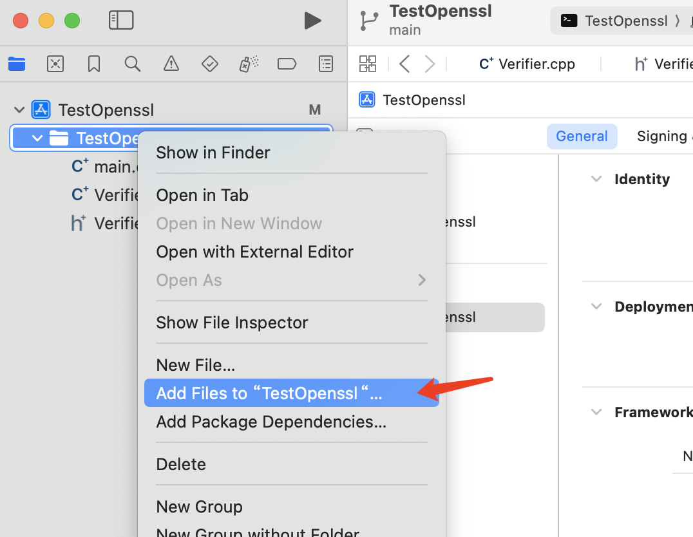
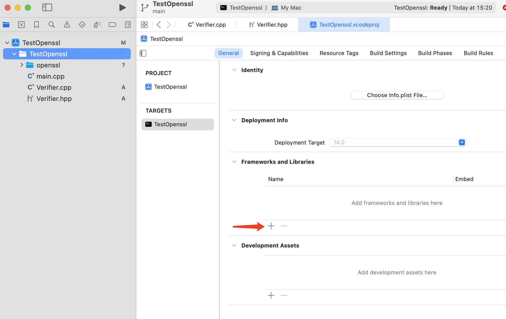
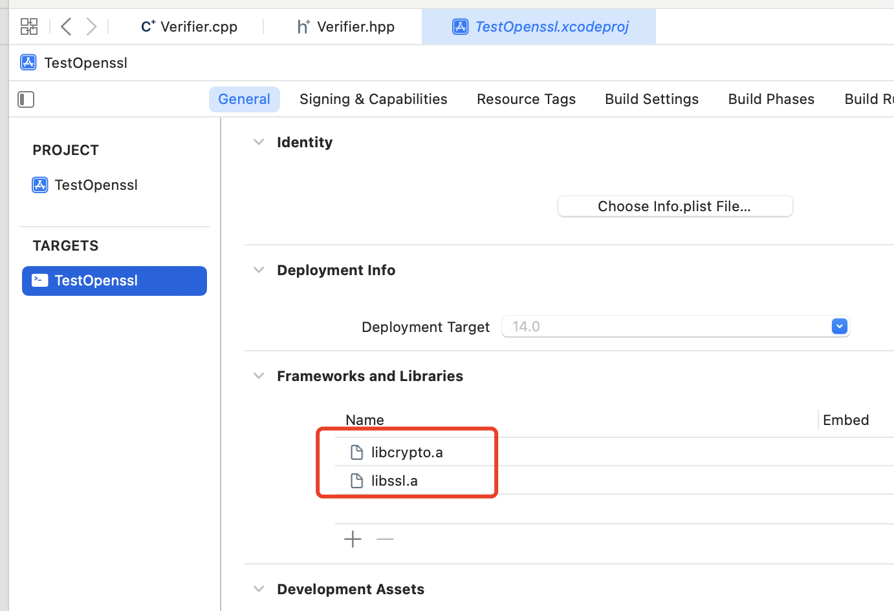
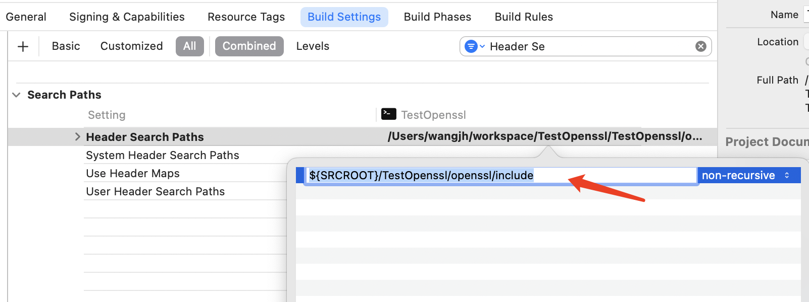
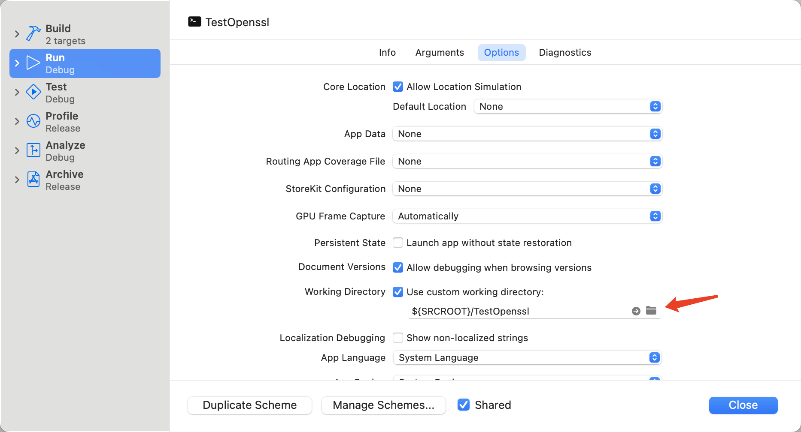
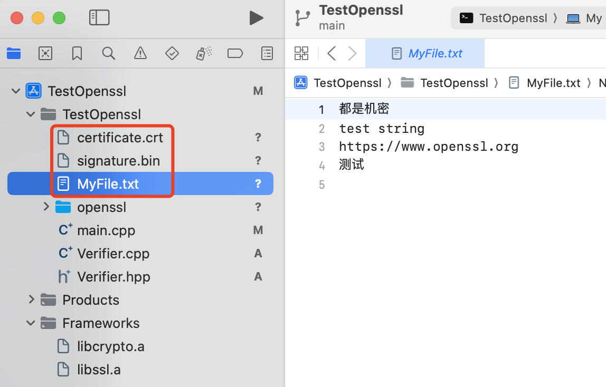

# iOS/MacOS

以下操作在 Macbook Pro（M1芯片，MacOS Sonoma 14.0）上完成。

## 编译 OpenSSL

需要确认一下本地开发环境，比如执行 `xcode-select -print-path` ，看看路径是否正确。我这里需要运行 `sudo xcode-select -switch /Applications/Xcode.app/Contents/Developer` 来设定正确的开发环境变量。

以下只针对 **iOS 真机**、**iOS 模拟器** 和 **MacOS** 环境进行编译，其它环境可以类似操作。

在编译的时候我碰到了一些编译问题，例如 `.../clang/15.0.0/include/inttypes.h:21:15: fatal error: 'inttypes.h' file not found` 这种离奇的报错。这时候不要慌，**重启**一下系统或许就解决了……

### iOS

OpenSSL iOS 编译指南： https://wiki.openssl.org/index.php/Compilation_and_Installation#iOS

```bash
cd ~/workspace/openssl-3.0.12

export CC=clang
export CROSS_TOP=/Applications/Xcode.app/Contents/Developer/Platforms/iPhoneOS.platform/Developer
export CROSS_SDK=iPhoneOS.sdk
export PATH=/Applications/Xcode.app/Contents/Developer/Toolchains/XcodeDefault.xctoolchain/usr/bin:$PATH

export WORK_PATH=$(pwd)

./Configure ios64-cross no-shared no-dso no-engine --prefix=$WORK_PATH"/openssl-ios64"

make
make install
make clean

cd openssl-ios64/lib
mv libcrypto.a libcrypto-iOS.a
mv libssl.a libssl-iOS.a
```

这里 `CROSS_SDK` 的值可以 `ls /Applications/Xcode.app/Contents/Developer/Platforms/iPhoneOS.platform/Developer/SDKs` 来查看。一般是一个到具体 SDK 目录的软连接。

具体的平台选项（这里我们用了 `ios64-cross`）可以查看源码目录下的 `Configurations/15-ios.conf`。

为了与后面 MacOS 的库进行区分，这里把编译出来的静态库改名为：

- `libssl-iOS.a`
- `libcrypto-iOS.a`

### iOS Simulator

模拟器跟真机的库是有区别的，需要单独编译。

```bash
cd ~/workspace/openssl-3.0.12

export CC=clang
export CROSS_TOP=/Applications/Xcode.app/Contents/Developer/Platforms/iPhoneSimulator.platform/Developer
export CROSS_SDK=iPhoneSimulator.sdk
export PATH=/Applications/Xcode.app/Contents/Developer/Toolchains/XcodeDefault.xctoolchain/usr/bin:$PATH

export WORK_PATH=$(pwd)

./Configure iossimulator-xcrun no-shared no-dso no-engine --prefix=$WORK_PATH"/openssl-iossimulator"

make
make install
make clean

cd openssl-iossimulator/lib
mv libcrypto.a libcrypto-iossimulator.a
mv libssl.a libssl-iossimulator.a
```

为了与后面 MacOS 的库进行区分，这里把编译出来的静态库改名为：

- `libssl-iossimulator.a`
- `libcrypto-iossimulator.a`

### MacOS

OpenSSL MacOS 编译指南： https://wiki.openssl.org/index.php/Compilation_and_Installation#OS_X

```bash
cd ~/workspace/openssl-3.0.12

export CROSS_TOP=/Applications/Xcode.app/Contents/Developer/Platforms/MacOSX.platform/Developer
export CROSS_SDK=MacOSX.sdk
export WORK_PATH=$(pwd)

# 编译 x86_64 版本
./Configure darwin64-x86_64-cc --prefix=$WORK_PATH"/openssl-darwin-x86_64" no-asm

make
make install
make clean

# 编译 arm64 版本
./Configure darwin64-arm64-cc --prefix=$WORK_PATH"/openssl-darwin-arm64" no-asm

make
make install
make clean

# 合并静态库
mkdir -p $WORK_PATH"/openssl-darwin"

lipo -create $WORK_PATH"/openssl-darwin-x86_64/lib/libssl.a" $WORK_PATH"/openssl-darwin-arm64/lib/libssl.a" -output $WORK_PATH"/openssl-darwin/libssl.a"

lipo -create $WORK_PATH"/openssl-darwin-x86_64/lib/libcrypto.a" $WORK_PATH"/openssl-darwin-arm64/lib/libcrypto.a" -output $WORK_PATH"/openssl-darwin/libcrypto.a"
```

具体的平台选项可以查看源码目录下的 `Configurations/10-main.conf`。

其生成的 `include` 目录下的头文件完全一致，只需要拷贝一份即可。

## 构建 Mac 测试项目

这里我们用一个测试的 C++ 项目来同样验证前面 OpenSSL 签名的文件（见 [构建密钥、证书及测试签名](#构建密钥、证书及测试签名) ）。

在 XCode 里创建一个命令行项目，代码类型选择 C++：


使用 Xcode 在项目里加入一个新的 C++ 文件 `Verifier.cpp`，Xcode 会贴心的创建对应的 `Verifier.hpp` 头文件。

`Verifier.hpp`：

```cpp
#ifndef Verifier_hpp
#define Verifier_hpp

#include <iostream>
#include <fstream>
#include <sstream>
#include <vector>
#include <algorithm>
#include <iterator>
#include <cstring>
#include <numeric>
#include <openssl/rsa.h>
#include <openssl/pem.h>
#include <openssl/evp.h>
#include <openssl/x509.h>
#include <openssl/bio.h>
#include <openssl/err.h>

using namespace std;

class Verifier
{
    public: Verifier(){};
    virtual ~Verifier(){};
    virtual bool verifyFile();
    virtual X509 *loadCertificate(const string &certEntityString);
    virtual string getKeyStrFromPublickKey(EVP_PKEY *publicKey);
    virtual bool verifySignature(const string &data, const string &publicKeyStr, const string &signatureStr);
    virtual string readFromFile(const string &filename);
};

#endif /* Verifier_hpp */
```

`Verifier.cpp`：

```cpp
#include "Verifier.hpp"

bool Verifier::verifyFile()
{
    // Load public key certificate and signature file
    string signStr = readFromFile("signature.bin");
    string certStr = readFromFile("certificate.crt");

    X509 *certificate = loadCertificate(certStr);

    // Read the file to verify (assuming it is a text file)
    string fileData = readFromFile("MyFile.txt");

    // Create a signature object
    EVP_MD_CTX *mdctx = EVP_MD_CTX_new();
    const EVP_MD *md = EVP_sha256();
    EVP_MD_CTX_init(mdctx);
    EVP_VerifyInit_ex(mdctx, md, NULL);

    // Initialize the signature verification, extract the public key from the certificate
    EVP_PKEY *publicKey = X509_get_pubkey(certificate);
    if (publicKey == nullptr)
    {
        std::cout << "Cannot get public key" << std::endl;
        return 1;
    }

    // PEM_write_PUBKEY(stdout, publicKey);  //print public key
    string publicKeyStr = getKeyStrFromPublickKey(publicKey);

    bool verified = verifySignature(fileData, publicKeyStr, signStr);

    return verified;
}

string Verifier::getKeyStrFromPublickKey(EVP_PKEY *publicKey)
{
    // 创建一个BIO以将公钥内容输出到字符串
    string publicKeyStr;
    BIO *publicKeyBio = BIO_new(BIO_s_mem());
    if (PEM_write_bio_PUBKEY(publicKeyBio, publicKey) == 1)
    {
        // 将BIO中的数据读取到字符串变量中
        char *buffer;
        long publicKeySize = BIO_get_mem_data(publicKeyBio, &buffer);
        if (publicKeySize > 0)
        {
            publicKeyStr.assign(buffer, publicKeySize);
        }
    }

    // std::cout << "Publick key: \n" << publicKeyStr << std::endl;
    return publicKeyStr;
}

// Verify the sinature with File content, Public Key and Signature strings
bool Verifier::verifySignature(const string &data, const string &publicKeyStr, const string &signatureStr)
{
    ERR_load_crypto_strings();
    OpenSSL_add_all_algorithms();

    // 读取公钥字符串到 BIO
    BIO *publicKeyBIO = BIO_new_mem_buf(publicKeyStr.c_str(), -1);
    RSA *rsa = nullptr;

    // 从 BIO 中解析 PEM 格式的公钥
    rsa = PEM_read_bio_RSA_PUBKEY(publicKeyBIO, &rsa, nullptr, nullptr);

    // 创建 EVP_MD_CTX 对象用于验证
    EVP_MD_CTX *md_ctx = EVP_MD_CTX_new();
    EVP_MD_CTX_init(md_ctx);

    // 设置要验证的哈希算法 (SHA256 in this case)
    const EVP_MD *md = EVP_sha256();

    // 在 EVP_MD_CTX 对象中设置公钥
    EVP_PKEY *pkey = EVP_PKEY_new();
    EVP_PKEY_assign_RSA(pkey, rsa);
    EVP_MD_CTX_set_pkey_ctx(md_ctx, EVP_PKEY_CTX_new(pkey, nullptr));

    // 更新签名算法的上下文，使用要验证的数据（例如文件内容）
    EVP_DigestVerifyInit(md_ctx, nullptr, md, nullptr, pkey);

    // 更新签名算法的上下文，使用要验证的数据（例如文件内容）
    EVP_DigestUpdate(md_ctx, data.c_str(), data.size());

    // 验证签名
    int result = EVP_DigestVerifyFinal(md_ctx, reinterpret_cast<const unsigned char *>(signatureStr.c_str()), signatureStr.size());

    // 释放资源
    EVP_MD_CTX_free(md_ctx);
    EVP_cleanup();
    CRYPTO_cleanup_all_ex_data();
    ERR_free_strings();

    // 根据验证结果输出校验结果
    if (result == 1)
    {
        std::cout << "文件验证成功" << std::endl;
    }
    else
    {
        std::cout << "文件验证失败" << std::endl;
    }

    // 返回验证结果
    return (result == 1);
}

// Load Certificate content and return X509 object
X509* Verifier::loadCertificate(const string &certEntityString)
{
    BIO *bio = BIO_new(BIO_s_mem());
    const char *certificate = certEntityString.c_str();
    // std::cout << "Cert:\n" << certificate << std::endl;

    BIO_puts(bio, certificate);
    X509 *cert = PEM_read_bio_X509(bio, nullptr, nullptr, nullptr);
    if (cert == nullptr)
    {
        std::cout << "Cannot read certificate" << std::endl;
    }

    BIO_free(bio);
    return cert;
}

// Read a text file and return string
string Verifier::readFromFile(const string &filename)
{
    std::ifstream file(filename);

    if (!file)
    {
        // Return an empty string if unable to open the file
        return "";
    }

    string content((std::istreambuf_iterator<char>(file)),
                   (std::istreambuf_iterator<char>()));

    file.close();

    // std::cout << "File data: \n" << content << std::endl;
    return content;
}
```

代码里会报错，因为我们还没有把前面的 OpenSSL 库引入。

在当前 `main.cpp` 所在目录下创建一个 `openssl` 目录，将前面编译的 `libcrypto-iOS.a` 、`libssl-iOS.a`、`libcrypto-iossimulator.a` 、`libssl-iossimulator.a` 以及 `~/workspace/openssl-3.0.12/openssl-darwin/libcrypto.a` 和 `~/workspace/openssl-3.0.12/openssl-darwin/libssl.a` 拷贝到 `openssl` 目录，然后把前面 `~/workspace/openssl-3.0.12/openssl-darwin-arm64/include` 整个目录也拷贝到 `openssl` 目录。

在 Xcode 的项目上用鼠标右键弹出菜单，选择 "Add Files to...." ，把刚才的 `openssl` 目录加入到项目里。



再把静态库加入到项目的 Framework and Libraries 里：






把头文件搜索路径添加到 Header Search Paths 里（值为 `${SRCROOT}/<项目名>/openssl/include` ）：




修改项目的 Schema，让项目工作路径为当前源码目录 `${SRCROOT}/TestOpenssl`




把前面 OpenSSL 命令行生成的证书、签名和测试文件也放置到代码相同的目录下：


修改 `main.cpp`：

```cpp
#include "Verifier.hpp"

int main(int argc, const char * argv[]) {
    Verifier *verifier = new Verifier();

    return verifier->verifyFile() ? 0 : 1;
}
```

命令行编译：

```bash
cd ~/workspace/TestOpenssl/TestOpenssl
export WORK_PATH=$(pwd)

clang++ -g Verifier.cpp main.cpp -o main -I $WORK_PATH/openssl/include -lssl -lcrypto -L $WORK_PATH/openssl -std=c++11
```

运行测试：

```bash
./main
文件验证成功

# 修改 MyFile.txt 内容后再运行
./main
文件验证失败
```

### 编译静态库

```bash
cd ~/workspace/TestOpenssl/TestOpenssl
export WORK_PATH=$(pwd)

clang++ -g -c Verifier.cpp -o verifier.o -I $WORK_PATH/openssl/include -lssl -lcrypto -L $WORK_PATH/openssl -std=c++11 -lobjc -framework CoreFoundation

libtool -static -o libverifier.a *.o openssl/libssl.a openssl/libcrypto.a
```

在这个项目里，我们想把 `Verifier.cpp` 直接编译成支持 iOS 真机 和 iOS 模拟器 的静态库，这样就不用把源代码到处拷贝了：

```bash
cd ~/workspace/TestOpenssl/TestOpenssl
export WORK_PATH=$(pwd)

# iOS 真机
# 查看 SDK 路径
xcrun -sdk iphoneos --show-sdk-path
export SDK_PATH=$(xcrun -sdk iphoneos --show-sdk-path)

export CROSS_TOP=/Applications/Xcode.app/Contents/Developer/Platforms/iPhoneOS.platform/Developer
export CROSS_SDK=iPhoneOS.sdk

clang++ -g -c Verifier.cpp -o verifier-iOS.o -I $WORK_PATH/openssl/include -lssl -lcrypto -L $WORK_PATH/openssl/*-iOS.a -std=c++11 -lobjc -framework CoreFoundation -arch arm64 -mios-version-min=7.0.0 -fno-common -isysroot $SDK_PATH

libtool -static -o libverifier-iOS.a *-iOS.o openssl/*-iOS.a


# iOS 模拟器
# 查看 SDK 路径
xcrun -sdk iphonesimulator --show-sdk-path
export SDK_PATH=$(xcrun -sdk iphonesimulator --show-sdk-path)

export CROSS_TOP=/Applications/Xcode.app/Contents/Developer/Platforms/iPhoneSimulator.platform/Developer
export CROSS_SDK=iPhoneSimulator.sdk

clang++ -g -c Verifier.cpp -o verifier-iossimulator.o -I $WORK_PATH/openssl/include -lssl -lcrypto -L $WORK_PATH/openssl/*-iossimulator.a -std=c++11 -lobjc -framework CoreFoundation  -mios-simulator-version-min=12.0 -fno-common -DIOS_PLATFORM=SIMULATOR64 -isysroot $SDK_PATH

libtool -static -o libverifier-iossimulator.a *-iossimulator.o openssl/*-iossimulator.a
```

## 以下作废，并不好用……

--------------

不使用此方法的原因是虽然编译出来了静态库，但因为此项目脚本魔改了头文件，而修改后头文件的宏在 Xcode 中可能会有无法预知的问题，比如我就遇到了 `openssl/bn.h:186:39 Unknown type name 'BN_ULONG'` 的报错……

克隆 https://github.com/x2on/OpenSSL-for-iPhone 到本地

然后进入 OpenSSL-for-iPhone 目录，运行 `./build-libssl.sh` 脚本即可编译。目前缺省版本为 **openssl-1.1.1w** 。

编译完成后的静态库放置在当前目录的 **lib** 子目录，头文件在 **include** 子目录。
