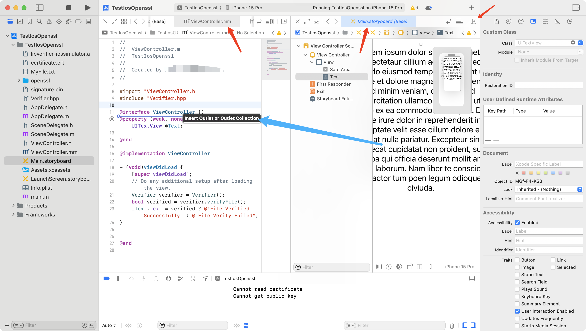
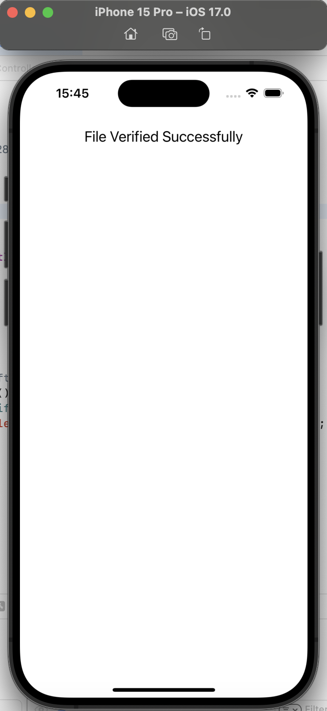

### [中文](./README_zh-CN.md)

# iOS

Here we need to complete works in [OpenSSL for MacOS](../MacOS/README.md)。

## Demo for iOS

Create a new project in Xcode and choose iOS App：


Interface choose `Storyboard`, and Language choose `Objective-C`:


Select `Main.Storyboard` in the left panel and add a Text View in the View:


Just like what we do in MacOS demo, add the files and library we created in MacOS demo to this project:


⚠️ The `Verifier.cpp` in the snapshot is not needed. And also remove .a files in `openssl` directory, only left `include` headers.

Rename `ViewController.m` to `ViewController.mm` for we are using C++ header.

Select `Main.Storyboard` and click icon "Add Editor on Right" to split the editor screen. Select `ViewController.mm` in the left screen and `Main.Storyboard` in right screen, then click the Text View we added and hold down the Ctrl key and drag the mouse to the appropriate location in the editor on the left, and the Property IBOutlet will be automatically created, named it `Text`:



Edite `ViewController.mm`:

```objectivec
#import "ViewController.h"
#import "Verifier.hpp"

@interface ViewController ()
@property (weak, nonatomic) IBOutlet UITextView *Text;

@end

@implementation ViewController

- (void)viewDidLoad {
    [super viewDidLoad];
    // Do any additional setup after loading the view.
    Verifier verifier = Verifier();
    bool verified = verifier.verifyFile();
    _Text.text = verified ? @"File Verified Successfully" : @"File Verify Failed";
}

@end
```

Compile and run the project:



**Note**: If you are using simulator, the static library should use `libverifier-iossimulator.a`. And for real iPhone, use `libverifier-iOS.a`.
